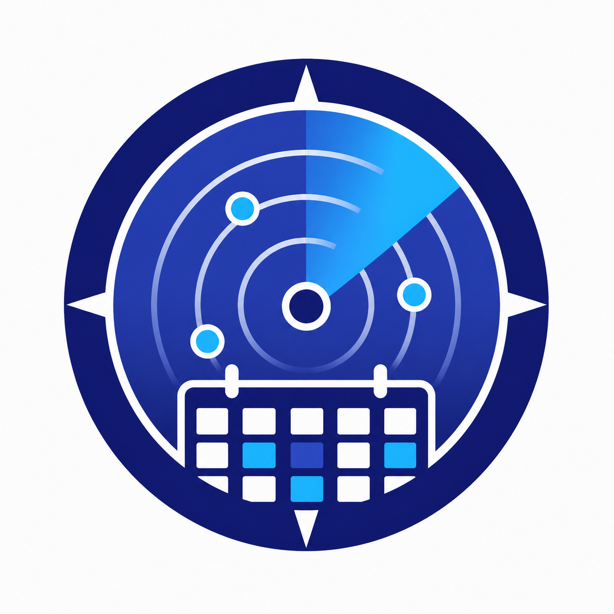
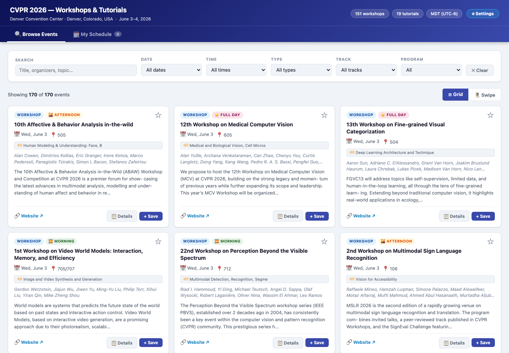
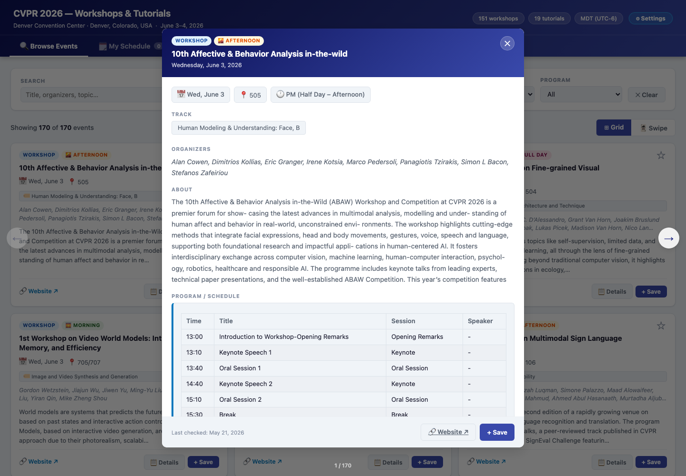
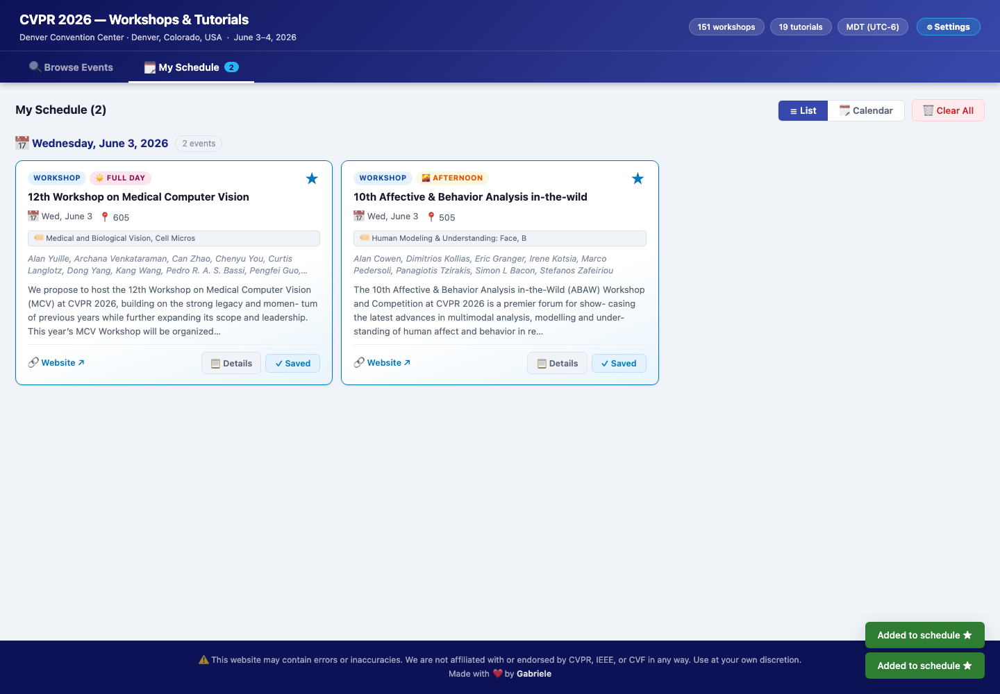
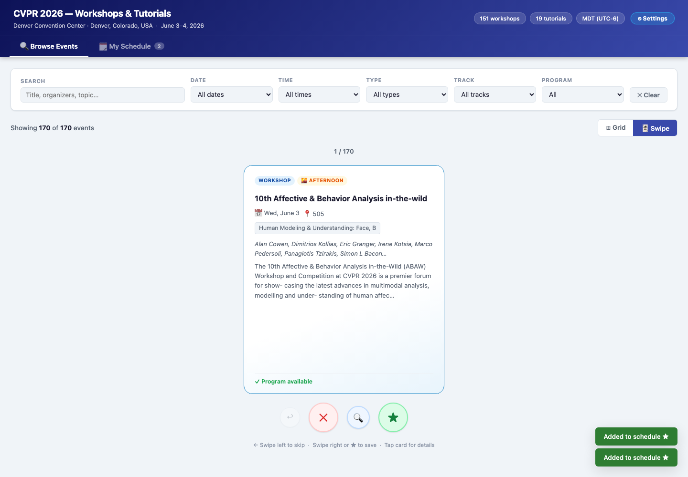

# CVPR Workshop Radar

  

**CVPR Workshop Radar** is an independent, searchable companion for exploring **CVPR 2026 workshops and tutorials**.

CVPR has a massive workshop and tutorial program. Finding the right sessions should not feel like opening twenty tabs, cross-checking PDFs, and hoping you did not miss the one workshop that perfectly matches your research.

**CVPR Workshop Radar** brings the program into one fast, friendly interface so you can search, filter, compare, save, and plan your workshop days with much less friction.

The goal is simple:

> Help researchers, students, and attendees quickly answer:  
> **“What should I actually attend?”**

## ✨ Preview

Add screenshots here once the UI is ready to show off.

| Browse Events | Event Details |
| --- | --- |
|  |  |

| My Schedule | Swipe Mode |
| --- | --- |
|  |  |

## 🚀 What It Does

CVPR Workshop Radar helps you move from “what is happening?” to “what should I attend?” with:

- 🔎 **Unified browsing**  
  Explore workshops and tutorials from one interface instead of bouncing between scattered pages.

- ⚡ **Fast search**  
  Search across titles, organizers, summaries, and topics.

- 🎛️ **Smart filters**  
  Narrow events by date, time slot, event type, track, and program availability.

- 📋 **Rich event details**  
  Open detailed views with summaries, organizers, rooms, links, and program schedules when available.

- ⭐ **Personal schedule**  
  Save interesting events to a personal schedule stored locally in your browser.

- 🗓️ **Schedule views**  
  Review saved events as a list or in a calendar-style view.

- 🃏 **Swipe mode**  
  Quickly triage sessions when you want to browse fast and decide later.

- 🗺️ **Venue map support**  
  Open room maps for supported locations.

## 🧭 Why This Exists

Workshop and tutorial days are often where some of the most interesting conversations happen: emerging topics, focused communities, niche challenges, early ideas, and practical sessions that do not always stand out in a giant program.

This project is meant to make that landscape easier to navigate. It is not an official schedule, and it is not trying to replace official sources. It is a planning layer: something quick, searchable, and useful when you are deciding where your time should go.

## ⚠️ Disclaimer

This project is built on automatically collected information. Workshop and tutorial details are scraped from public sources and processed with a Large Language Model (LLM), which means the website may contain errors, missing information, outdated details, formatting issues, or incorrect interpretations of schedules and program content.

Please verify important information with the official CVPR website and the official workshop or tutorial pages before making plans.

CVPR Workshop Radar is an independent project. It is **not affiliated with, endorsed by, or officially connected to CVPR, IEEE, CVF, or the organizers of CVPR 2026** in any way.

## 🛠️ Reporting Issues and Corrections

Found a wrong room? A missing program? A broken link? A summary that looks suspiciously overconfident?

Please open a GitHub issue using the provided issue template. It is designed for corrections and suggestions related to a specific workshop or tutorial, as well as general website issues.

The template is designed for:

- incorrect titles, organizers, times, rooms, tracks, summaries, websites, or programs;
- suggested updates to a particular workshop or tutorial;
- official source links that verify a correction;
- general website bugs or usability problems.

Reports with official links are especially helpful, because the underlying information is generated automatically and corrections should be grounded in reliable sources.

## ⚙️ Technical Details

Details about the data pipeline and the website architecture are documented in [docs/TECHNICAL.md](docs/TECHNICAL.md).

The pipeline goes from the official CVPR PDF program → static metadata extraction → LLM-powered schedule scraping with Playwright and a local Ollama model → a static single-page application served on Vercel.

## 💛 Contributions

Corrections, suggestions, and source links are welcome. The most useful contributions are precise reports tied to a specific workshop or tutorial, especially when they include an official page that verifies the update.

This project gets better when people spot the small mistakes that automated pipelines tend to miss.
