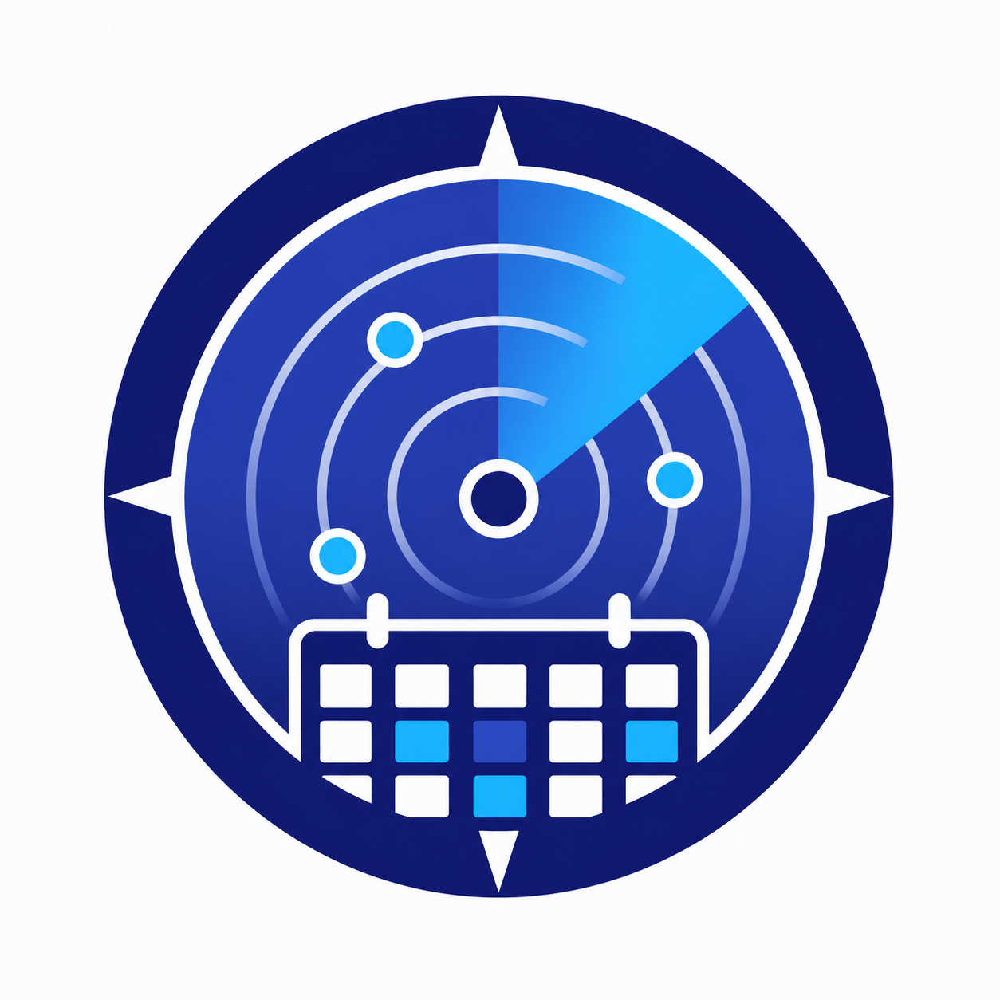

# Workshop Radar

<p align="center">
  
</p>

<h2 align="center">
  <a href="https://workshopradar.vercel.app">🌐 Visit Workshop Radar</a>
</h2>

**Workshop Radar** is an independent, searchable companion for exploring conference workshops and tutorials. The live experience currently tracks **ECCV 2026**; earlier programmes remain available in the archive.

Large workshop and tutorial programmes should not feel like opening twenty tabs, cross-checking PDFs, and hoping you did not miss the one session that perfectly matches your research.

**Workshop Radar** brings the programme into one fast, friendly interface so you can search, filter, compare, save, and plan workshop days with much less friction.

The goal is simple:

> Help researchers, students, and attendees quickly answer:  
> **“What should I actually attend?”**

## ✨ Preview

**Main Features**


**Schedule & My Schedule**


## 🚀 What It Does

Workshop Radar helps you move from “what is happening?” to “what should I attend?” with:

- 🔎 **Unified browsing**  
  Explore workshops and tutorials from one interface instead of bouncing between scattered pages.

- ⚡ **Fast search**  
  Search across titles, organizers, summaries, and topics.

- 🎛️ **Smart filters**  
  Narrow events by date, time slot, event type, track, and program availability.

- 📋 **Rich event details**  
  Open detailed views with summaries, organizers, rooms, links, and program schedules when available.

- ⭐ **Personal schedule**  
  Save interesting events to a personal schedule stored locally in your browser.

- 🗓️ **Schedule views**  
  Review saved events as a list or in a calendar-style view.

- 📅 **Timeline view**  
  Visualize your saved events on a day-by-day timeline to spot overlaps and plan your schedule at a glance.

- 🃏 **Swipe mode**  
  Quickly triage sessions when you want to browse fast and decide later.

- 🗺️ **Venue map support**  
  Open room maps for supported locations.

## 🧭 Why This Exists

Workshop and tutorial days are often where some of the most interesting conversations happen: emerging topics, focused communities, niche challenges, early ideas, and practical sessions that do not always stand out in a giant program.

This project is meant to make that landscape easier to navigate. It is not an official schedule, and it is not trying to replace official sources. It is a planning layer: something quick, searchable, and useful when you are deciding where your time should go.

## ⚠️ Disclaimer

This project is built on automatically collected information. Workshop and tutorial details are scraped from public sources and processed with a Large Language Model (LLM), which means the website may contain errors, missing information, outdated details, formatting issues, or incorrect interpretations of schedules and program content.

Please verify important information with the official conference website and the official workshop or tutorial pages before making plans.

Workshop Radar is an independent project. It is **not affiliated with, endorsed by, or officially connected to any conference organizer**.

## 🛠️ Reporting Issues and Corrections

Found a wrong room? A missing program? A broken link? A summary that looks suspiciously overconfident?

Please open a GitHub issue using the provided issue template. It is designed for corrections and suggestions related to a specific workshop or tutorial, as well as general website issues.

The template is designed for:

- incorrect titles, organizers, times, rooms, tracks, summaries, websites, or programs;
- suggested updates to a particular workshop or tutorial;
- official source links that verify a correction;
- general website bugs or usability problems.

Reports with official links are especially helpful, because the underlying information is generated automatically and corrections should be grounded in reliable sources.

## ⚙️ Technical Details

Details about the data pipeline and the website architecture are documented in [docs/TECHNICAL.md](docs/TECHNICAL.md).

The pipeline goes from official PDF or web listings → static metadata extraction → LLM-powered schedule scraping with Playwright and a local Ollama model → a static single-page application served on Vercel.

## Adding or updating a conference

Run the guided entry point:

```bash
python3 ingest_conference.py
```

Choose a conference, enter its official workshop/tutorial listing URLs and/or programme PDF, then review the generated JSON. For ECCV 2026, use the canonical `Conferences/2026/Workshops` and `Conferences/2026/Tutorials` listing pages rather than the virtual-event endpoints. The script optionally renders venue maps and asks before starting the longer Ollama schedule extraction. Generated data is not made live automatically: review it first, then add or update its record in `conferences.json`.

`conferences.json` controls the active conference, visual theme, source URLs, data file, archive status, and optional map assets. A conference in `upcoming` status renders a “Stay tuned” page without exposing incomplete event data.

Conference material is grouped under `conferences/<conference-id>/`: use `data/` for generated programme data, `source/` for official documents, `maps/` for venue assets, and `scripts/` for conference-specific tooling. Shared ingestion and Ollama tools remain at the repository root.

## 💛 Contributions

Corrections, suggestions, and source links are welcome. The most useful contributions are precise reports tied to a specific workshop or tutorial, especially when they include an official page that verifies the update.

This project gets better when people spot the small mistakes that automated pipelines tend to miss.
